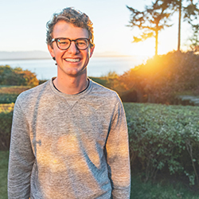
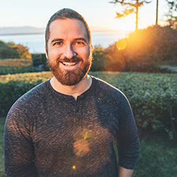
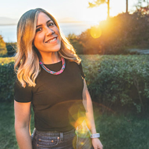
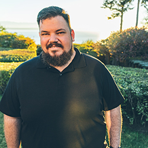
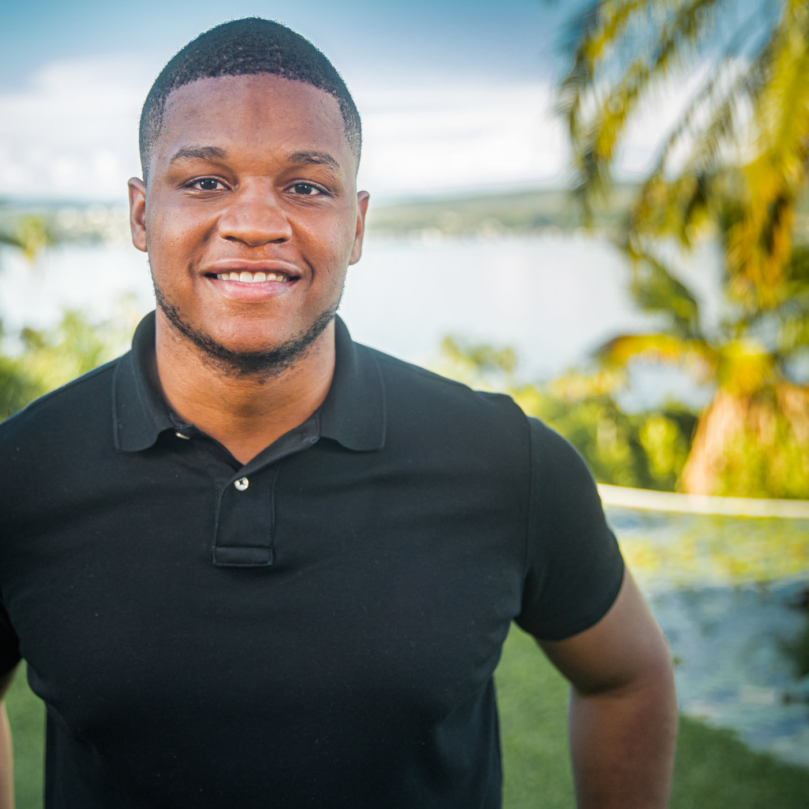

# Tech Team
This team was built through much searching and deliberation. Members will come and go over time, but their contribution is no less important. Beyond merely making an appearance in the [contributor log](https://github.com/newstorycharity/newstory/graphs/contributors) on Github, this section adds color and a heartbeat to the team members behind the software.

This isn't about titles ([you can find those here](https://newstorycharity.org/team/)). It's about the people that helped shape technology at New Story.

_P.S. Feel free to maintain your own profile. It's part of your legacy at New Story._

---

## Matthew Marshall
**(2014-present)**  
### Why New Story?
I desire to serve those around me and while I can do that in my personal life, it's rare to get to say that about your career as well. I have to count my blessing constantly and pinch my self many times each week to reflect on how special this opportunity is.

### What excites you most about our vision?
Gosh, so much. Mainly, working with fantastic people that you keep wanting to hang out with, a world-class culture, and the impact we can see daily in the lives of those we are so blessed to work with.

### Who has had the greatest impact on your career in technology? Why?
_Morgan Lopes._ He's one of the sharpest minds around, but more importantly, he knows how to balance tradeoffs, see the forest for the trees, and make those around him sharper and more human :)

_Sophia V Prater._ She's also one of the sharpest people I know! Her UX expertise shaped how I see the role of UX and UI and balancing cool products with useable products.

_Basecamp._ It's hard to sum this one up, so I would suggest reading their book -> https://basecamp.com/books/getting-real (it's free!

### What would you say to our next hire?
There were a lot of great candidates, but you were ultimately selected for the following reasons: 1) you're a great human that displays our values and will make us even stronger 2) you're multi-talented 3) you're crazy hungry to impact the world with us. 

We're so excited for your contribution because every day matters and your work matters! The world will be better than it was yesterday because of you, this team, and our mission! Let's go!

---

## Morgan J Lopes
**(2016-present)**  
### Why New Story?
The most fulfilling work in life is that which is done in service to others. New Story continues to present the greatest opportunity for intentional, lasting impact for the largest percentage of those in need around the world.

### What excites you most about our vision?
Achieving it will require me and everyone involved to learn, grow, and stretch more than we even thought possible. The notion the a life lived in service to others will yield the greatest version of ourselves is a beautiful paradox that I'm excited to continue exploring.

### Who has had the greatest impact on your career in technology? Why?
_Jason Ardell._ His investment of time, energy, and encouragement is a debt I could never repay. Beyond teaching me how to think like an engineer, the leadership he modeled has impacted my life, my family, the teams I've helped build, those at New Story, and far beyond. His request has been simple, 'go and do likewise'.

_John Rae._ One of the first few hires at [Polar Notion](https://polarnotion.com), John's tenacity and adaptability highlighted a chance for my work to mean more than just the software I wrote. Helping him become a software engineer reframed my efforts as a professional and challenged me to emulate the example that Jason shared by both teaching others and challenging them to do likewise.

### What would you say to our next hire?
The [Welcome Letter](/welcome.md) was written for you, start there.

Congratulations! Purpose filled work is a gift. Enjoy.

We move quickly here because the work matters. Keep up. Every day, thousands of people are born into the population of 1.3 billion without proper housing. Each day, thousands die within that population from the abysmal conditions of survival mode. When the work seems tiresome, remember that it's not for you. It's for them.

That being said, you'll have unbelievable experiences here with remarkable people. Working alongside so many high-performing, passion team members will challenge and inspire you. When it does, tell someone. The energy, excitement, and support is a necessary part of doing this work.

Lastly, push yourself. Our massive vision will require more from you than you can even imagine. You'll be expected to learn, grow, and challenge the status quo. Own your experience and dream bigger.

Godspeed,  
Morgan J Lopes

---

## Geraldine Galue
**(2016-present)**  
### Why New Story?
I was born and raised in a developing country, therefore I understand the struggles that these families face day to day. When I discovered New Story and learned about how I could use my programming skills for good, I immediately knew that I had to be a part of it.

### What excites you most about our vision?
What excites me the most about our vision is that we know that we can’t do it alone. Global homelessness is a 1 billion+ problem that is continuing to grow. We understand that in order to make an impact we have to double down, level up, and share all of our research with other organizations so that together we can build faster and better. It is incredibly humbling to know that you don’t have all of the answers, but that you are willing to research, learn, prove and share all of your findings in order to find solutions.

### Who has had the greatest impact on your career in technology? Why?
My brother in law for encouraging me to join a coding bootcamp and Morgan Lopes for believing in me and realizing that New Story was the perfect fit for me!

### What would you say to our next hire?
Push yourself and ask questions. Your opinion and voice always matters at New Story.

---

## Shane Ardell
**(2018-present)**  
### Why New Story?
The people & the purpose.

In fact, [I wrote an entire blog post about it](https://medium.com/p/2cf70d852114).

### What excites you most about our vision?
There are so many organizations out there trying to make an impact in the
world. The thing I love the most about New Story is the "humble pursuit of
excellence" philosophy. We aren't attached to the way we do things. Our
processes are in place because we have well-thought out reasons for doing so,
however if we get new data, feedback, or technologies that can do it better,
we're all for it. Whatever best serves the families we hope to impact.

### Who has had the greatest impact on your career in technology? Why?
Definitely my husband. First and foremost, he is the one that believed I could
do well as a programmer even when I didn't. He also mentored me (and still
does). And he's a constant learner and helps keep me up to date. :-)

### What would you say to our next hire? 
Celebrate small wins.

Power through roadblocks.

Take care of yourself.

Work at a sustainable pace.

Raise/escalate issues early, while they're still small.

Remember that every small achievement behind the computer screen makes a
difference in the real world for real people, not to line someone's pockets.

---

## Tim Whitacre
**(2018-present)**  

### Why New Story?
Initially, I was drawn to New Story because of the cause but quickly fell in love with the team. This is a group of hard-working, people loving individuals that I consider my self very fortunate to work alongside.

### What excites you most about our vision?
I have believed for a long time now, that technology is the solution to mankind's biggest problems. Global homelessness is no exception. At New Story, we get to come up with innovative ideas that will help meet one of the greatest needs and empower other organizations to do the same.

### Who has had the greatest impact on your career in technology? Why?
When I first moved to Atlanta, I worked for [The Iron Yard](https://twitter.com/theironyard). Their leadership team ([Peter Barth](https://www.linkedin.com/in/peterbarth/), [Eric Dodds](https://ericdodds.com/), [Mason Stewart](http://masondesu.com/) and [John Saddington](https://john.do/)) have easily been some of the most influential people in my entire career. I learned that technology is accessible by so many and that anyone can use it to create meaningful solutions. 

### What would you say to our next hire?
- Welcome! This is going to be lots of fun.

---

## Eddie Dozier
**(2019-present)**  
### Why New Story?

New Story had my attention when I learned more about its mission, and definitely the team!

### What excites you most about our vision?

The most exciting thing about the vision here at New Story is the multiplying effect we're building by using technology as our driving force.
It may seem like an obvious way to tackle a global issue but so many non-profit organizations have yet to really use tech to power there mission!

### Who has had the greatest impact on your career in technology? Why?
One of my many mentors Dr. Paul Judge has been my greatest inspiration in tech because he's help redefine and shape Atlanta's tech scene,
and he continues to promote diversity and entrepreneurship in the industry! 

### What would you say to our next hire? 

- Be bold and push the envelope in terms of development so that you can have the most impact with your work.
- If you ever need help, you'll work with the most helpful people ever so don't be afriad to ask!
- Buckle up, it's gonna be one heck of a ride!

---

## Tun Khine
**(2019-present)**  
### Why New Story?

Being in service to others has been a cornerstone in my upbringing and career. When I first heard Tim speak at a meetup, I knew I had to meet him and learn more. That led to research and the deliberate intention to contribute to the growth and mission of New Story.  

### What excites you most about our vision?

One of the most exciting things about the vision is not just the desire to make impact but the real HUNGER to make a MASSIVE impact to the 1.3 billion without proper housing. 

### Who has had the greatest impact on your career in technology? Why?

_Mollie Khine._, my life parter - She taught me to never settle, go beyond, dream big and chase those dreams relentlessly. 

_Britt Butler._ - An amazing human being who has a natural gift of an educator and desire to teach those next generation developers. 

### What would you say to our next hire? 

Yep, you just did that. You joined a team of amazing humans who won't settle for the status quo. Sound familiar?? Probably, because its a quality of yours as well. Get excited because you're about to impact and change the lives of those in need. 

